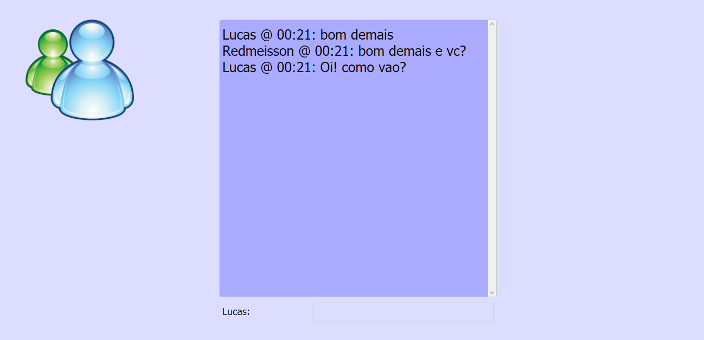

# _Web Sockets API_

Exemplo de uso da API de _Web Sockets_ do HTML5 que:

- API que estabelece conexões de via sockets entre um navegador da web e um servidor.

- Possibilita conexões persistentes entre cliente e servidor.

- Ambas as partes podem começar a enviar dados a qualquer momento.

## Links do Exemplo

- Link para seminário: [slide][slides]
- Link para exemplo publicado: [página no GitHub][vivo]

## Créditos

Este trabalho foi realizado em 2017/01 para a disciplina de Programação para Web do CEFET-MG no Campus II de Belo Horizonte.

Autor(es):

1. Lucas de Aguilar Junqueira Campos (201022040065)

[slides]: https://docs.google.com/presentation/d/1CQnGpvu2Ibnk_2xpbOxhZfrZV3kzIBHRROhex9JqqyI/pub?start=false&loop=false&delayms=60000
[vivo]: https://lucasajc.github.io/cefet-web-weblot/api/web-sockets/client
