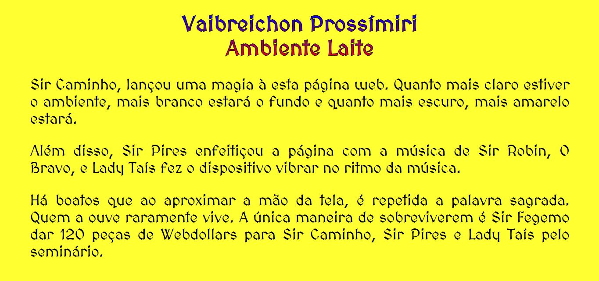

# _Ambient Light API_, _Proximity API_ e _Vibration API_

Exemplo de uso das APIs de _ambient light_, _proximity_ e _vibration_ do HTML5.

## Links do Exemplo

* Link seminário: [Repositório GitHub] [seminario]
* Link para exemplo publicado: [página no GitHub][vivo]

## Créditos

Este trabalho foi realizado em 2018/01 para a disciplina de Programação para Web do CEFET-MG no Campus II de Belo Horizonte.

## Autores:

* Gabriel Pires de Miranda Magalhães (201422040011)
* Taís Rocha Silva (201412040140)
* Vinícius Magalhães D'Assunção (201422040232)

## Referências

* Fonte Ambient Light, [MDN - Ambient Light Events][ambient-light]
* Fonte Proximity, [MDN - Proximity Events][proximity]
* Fonte Vibration, [MDN - Vibration API][vibration]
* Fonte [MedievalSharp][medieval], criada por Wojciech Kalinowski
* Textura [Old Map][map], criada por Andreas Föhl
* Música Brave Sir Robin, do musical [Monty Python’s Spamalot][robin] (Sem fins lucrativos)
* Áudio NI, recortado por Vinícius Magalhães de [Monty Python and the Holy Grail (1975)][ni]

[seminario]: https://taisrs.github.io/cefet-web-seminario
[vivo]: https://fegemo.github.io/cefet-web-weblot/apis/ambient-light+proximity+vibration/
[ambient-light]: https://developer.mozilla.org/pt-BR/docs/Web/API/Ambient_Light_Events
[proximity]: https://developer.mozilla.org/en-US/docs/Web/API/Proximity_Events
[vibration]: https://developer.mozilla.org/en-US/docs/Web/API/Vibration_API
[medieval]: https://fonts.google.com/specimen/MedievalSharp
[map]: https://www.toptal.com/designers/subtlepatterns/old-map/
[robin]: https://www.theatricalrights.com/show/monty-pythons-spamalot/
[ni]: https://www.imdb.com/title/tt0071853/
