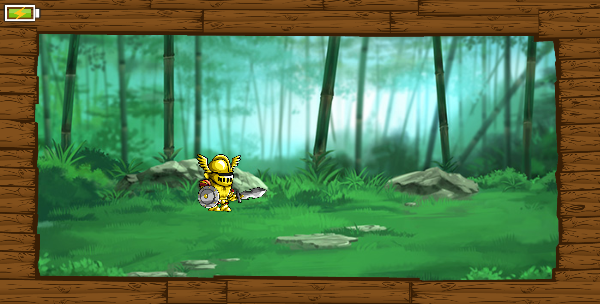

# _Battery Status API_

Exemplo de uso da API de _battery status_ do HTML5.

## Links do Exemplo

* Link seminário: [Repositório GitHub] [seminario]
* Link para exemplo publicado: [página no GitHub][vivo]

## Créditos

Este trabalho foi realizado em 2018/01 para a disciplina de Programação para Web do CEFET-MG no Campus II de Belo Horizonte.

## Autores:

* Gabriel Pires de Miranda Magalhães (201422040011)
* Taís Rocha Silva (201412040140)
* Vinícius Magalhães D'Assunção (201422040232)

## Referências

* [W3 - Battery Status][battery-status]
* [W3C - GitHub Pages][battery-gpages]
* [MDN - GitHub Pages][battery-mdn]
* [Netease Corporation - GIF fundo][gif]
* [Imagem borda][borda]
* [Personagem][personagem]

[seminario]: https://taisrs.github.io/cefet-web-seminario
[vivo]: https://fegemo.github.io/cefet-web-weblot/apis/battery-status/
[battery-status]: https://www.w3.org/TR/battery-status/
[battery-gpages]: https://w3c.github.io/battery/
[battery-mdn]: https://developer.mozilla.org/pt-BR/docs/Web/API/Battery-Status
[gif]: http://ly5282116.blog.163.com/blog/static/16183617920126111135221/
[borda]: http://www.fazzarimultimedia.com/blog/wood-grain-border-png/
[personagem]: https://craftpix.net/freebies/2d-fantasy-knight-free-sprite-sheets/