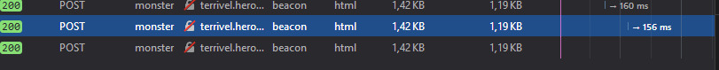

# _Beacon API_

Exemplo de uso da API _Beacon_.

## Links do Exemplo

- Link para seminário: [seminário][seminario]
- Link para repositório: [página no GitHub][github]
- Link para exemplo publicado: [página publicada][vivo]

## Créditos

Este trabalho foi realizado em 2018/02 para a disciplina de Programação para Web do CEFET-MG no Campus II de Belo Horizonte.

Autor(es):

1. Augusto Monteiro de Castro Silva Costa (201422040062)
2. Fabrício Fraga Rezende (201322040419)
3. Leonardo Carvalho Tereza (201422040470)

[seminario]: https://slides.com/augustomontc/deck/live#/	
[vivo]: https://ffrezende.github.io/web-seminario-apis/Canvas%20API/
[github]: https://github.com/ffrezende/cefet-web-weblot
