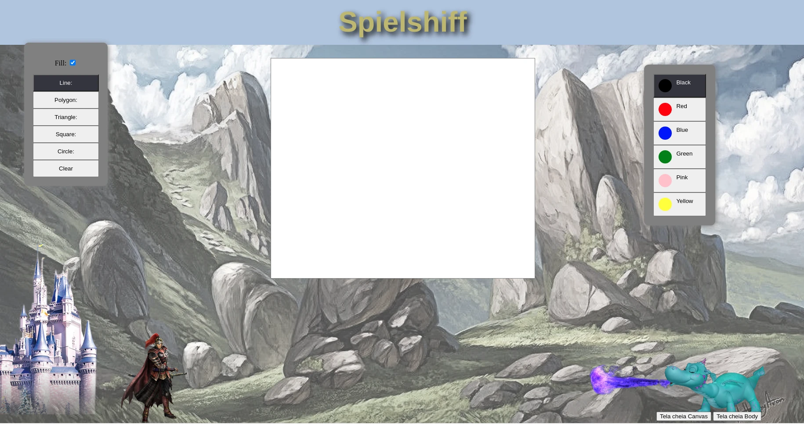

# Canvas API e Fullscreen API
Exemplo de uso da API canvas e de Fullscreen do HTML5. Veja o arquivo [`scripts/canvas.js`][js] para detalhes.

- Link para exemplo publicado: [página no GitHub][vivo]

## Créditos

Este trabalho foi realizado em 2021/01 para a disciplina de Programação para Web do CEFET-MG no Campus II de Belo Horizonte.

Autor(es):

1. Beatriz Souza Da Silva
2. Matheus Marques dos Santos
3. Pedro Cardoso Azevedo Teixeira
4. Priscilla Raiane Mendes do Carmo

[js]: scripts/canvas.js
[vivo]: https://fegemo.github.io/cefet-web-weblot/apis/canvas-fullscreen/

