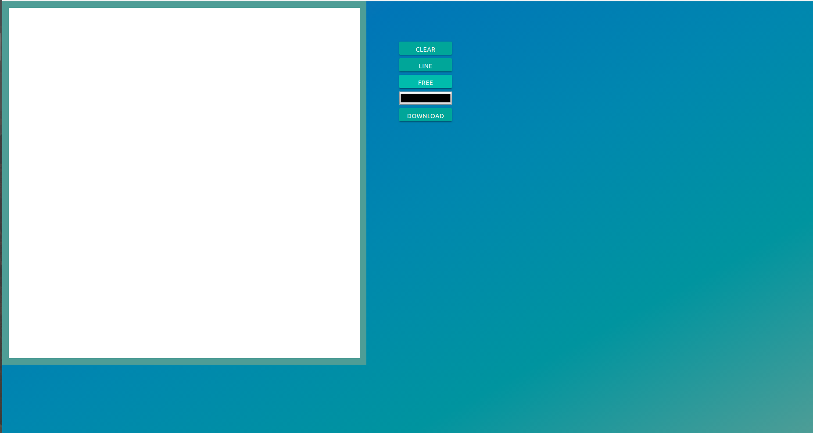

# _Drag and Drop API_

Exemplo de uso da tag de _Canvas_ do HTML5.

## Links do Exemplo

- Link para seminário: [slides de aula][slides]
- Link para exemplo publicado: [página no GitHub][vivo]

## Créditos

Este trabalho foi realizado em 2019/01 para a disciplina de Programação para Web do CEFET-MG no Campus II de Belo Horizonte.

Autor:

1. Pedro Henrique Lopes de Castro (201522040099)

Atribuições:

- Materialize [Site][Materialize-site]
- MDN Canvas Doc [Link][mdn-link]

[slides]: https://docs.google.com/presentation/d/1BqsVe0jVn2VqQ5yi_aE_CMZWfH162VFlGbiAoP8IVyg/edit?usp=sharing
[vivo]: https://pedrohlcastro.github.io/cefet-web-weblot/apis/canvas/
[Materialize-site]: https://materializecss.com
[mdn-link]:https://developer.mozilla.org/pt-BR/docs/Web/HTML/Canvas