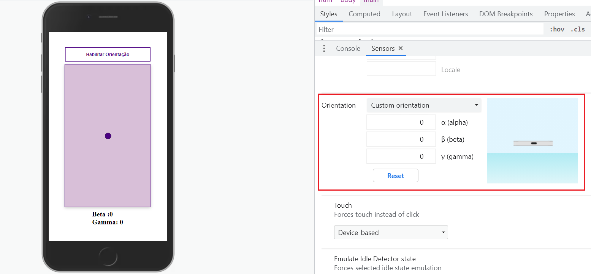

# _Device Orientation API_

Exemplo de uso da API de _device orientation_ do HTML5. Veja o arquivo [`script/device-orientation.js`][js] para detalhes.

- Link para exemplo publicado: [página no GitHub][vivo]
- Teste no seu celular: https://device-orientation-46286.web.app/

## Créditos

Este trabalho foi realizado em 2021/01 para a disciplina de Programação para Web do CEFET-MG no Campus II de Belo Horizonte.

Autor(es):

1. Clara Domingues de Ávila Marques (20183005505)
2. Nicolas Gomes de Rezende (20183005120)
3. Rodrigo Gomes Moreira da Silva (20183011718)
4. Lucca Fernandes Miranda Silva (20183011736)

[js]: scripts/device-orientation.js
[vivo]: https://fegemo.github.io/cefet-web-weblot/apis/device-orientation/

