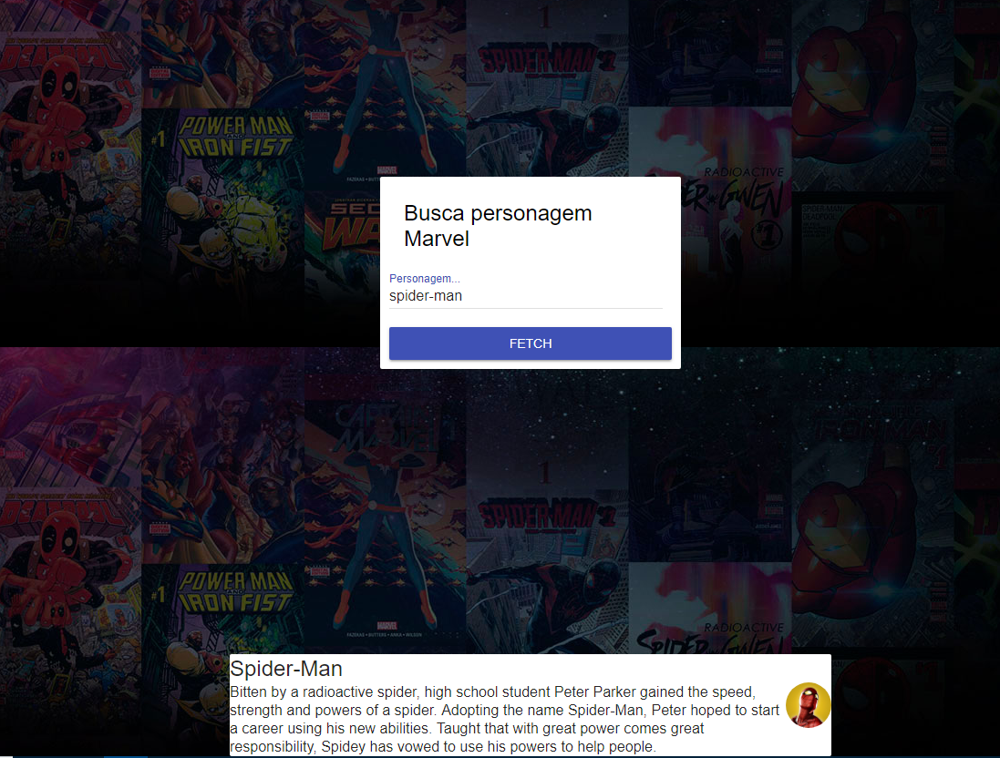

# _Fetch API_

Exemplo de uso da API de ***fetch*** do JS.

## Links do Exemplo

- Link para documentação: [MDN Docs][doc]
- Link para exemplo publicado: [página no GitHub][vivo]

## Créditos

Este trabalho foi realizado em 2018/01 para a disciplina de Programação para Web do CEFET-MG no Campus II de Belo Horizonte.

Autor(es):

1. Lucas Silvestre Viana (201422040240)
1. Victor Balbo de Oliveira (201422040178)

[doc]: https://developer.mozilla.org/pt-BR/docs/Web/API/Fetch_API
[vivo]: https://fegemo.github.io/cefet-web-weblot/apis/fetch/
