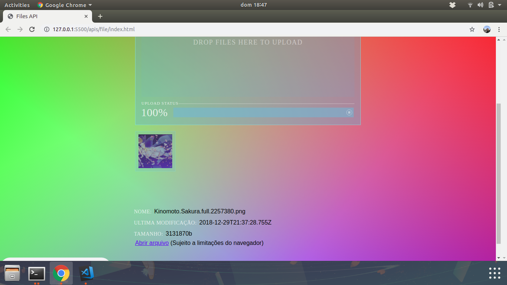

# _File API_

Exemplo de uso da tag de _File_ do HTML5.

## Links do Exemplo

- Link para seminário: [slides de aula][slides]
- Link para exemplo publicado: [página no GitHub][vivo]

## Créditos

Este trabalho foi realizado em 2019/01 para a disciplina de Programação para Web do CEFET-MG no Campus II de Belo Horizonte.

Autores:

1. Larissa de Cássia Nazaré Bicalho (201512040304)
2. Vinícius Henrique Silveira (201422040046)

Atribuições:

- MDN File Doc [Link][mdn-link]
- MOKUJI: collection of notes by Zac Fukuda [Link][mokuji-link]

[slides]: https://drive.google.com/open?id=1Rgj1jiePudbVQtuaz9k7twZlx4Wl0KS9leQtBIns5lc
[vivo]: https://silveiravinicius.github.io/cefet-web-weblot-file/
[mdn-link]: https://developer.mozilla.org/en-US/docs/Web/API/File
[mokuji-link]: https://www.mokuji.me/article/drop-upload-tutorial-1
