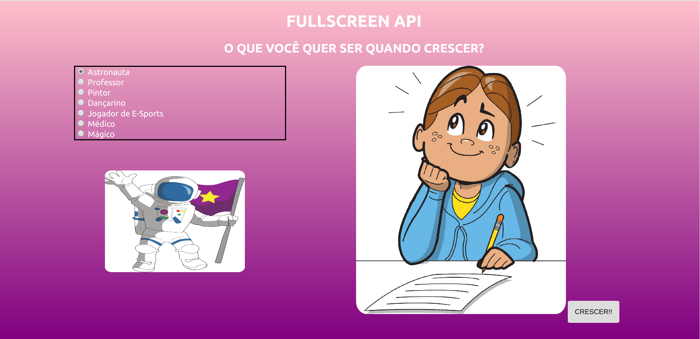

# _Fullscreen API_

API HTML que permite a maximização de elementos do DOM.

## Links do Exemplo

- Link para seminário: [clique aqui](andrelbol.github.io/Trabalhos-Web/Presentation)
- Link para exemplo publicado: [página no GitHub](https://fegemo.github.io/cefet-web-weblot/apis/full-screen-api/)

## Créditos

Este trabalho foi realizado em 2018/01 para a disciplina de Programação para Web do CEFET-MG no Campus II de Belo Horizonte.

Autor(es):

1. André Luís Borges de Oliveira
1. André Perazio Givisiez Fonseca
1. Thiago Magno Gomes

Atribuições:

- Fonte de Pesquisa: [MDN](https://developer.mozilla.org/pt-BR/)
- Fonte de Pesquisa: [sitepoint](https://www.sitepoint.com)
- Imagens: [Google Imagens : )](https://www.google.com.br/imghp?hl=pt-BR&tab=wi)
- [Mestre Jedi](https://github.com/fegemo) 
