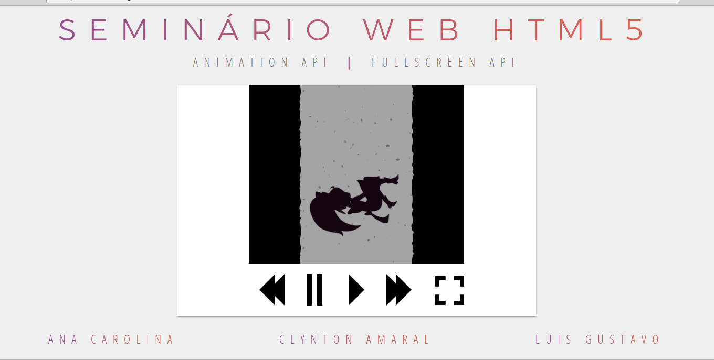

# Seminário Programação Web

## Fullscreen API
Uma API que proporciona usar diretamente o *browser* para fazer um elemento e seus filhos ocuparem a tela inteira.

## Web Animations API
Permite criar animações de alto desempenho, e oferece ferramentas para inspecionar e manipular os elementos das animações.

## Screenshot

## Links

[Slides da Apresentação](https://ctomacheski.github.io/cefet-web-presentation)
[Exemplo Vivo](https://fegemo.github.io/cefet-web-weblot/apis/fullscreen-web-animations/)

## Créditos
Autores:
- Ana Carolina
- Clynton Amaral
- Luis Gustavo

Exemplos:
[Web Animation API Tutorial](http://qnimate.com/web-animation-api-tutorial/)
[Web Animation API Documentation](https://developer.mozilla.org/en-US/docs/Web/API/Web_Animations_API/Using_the_Web_Animations_API)
