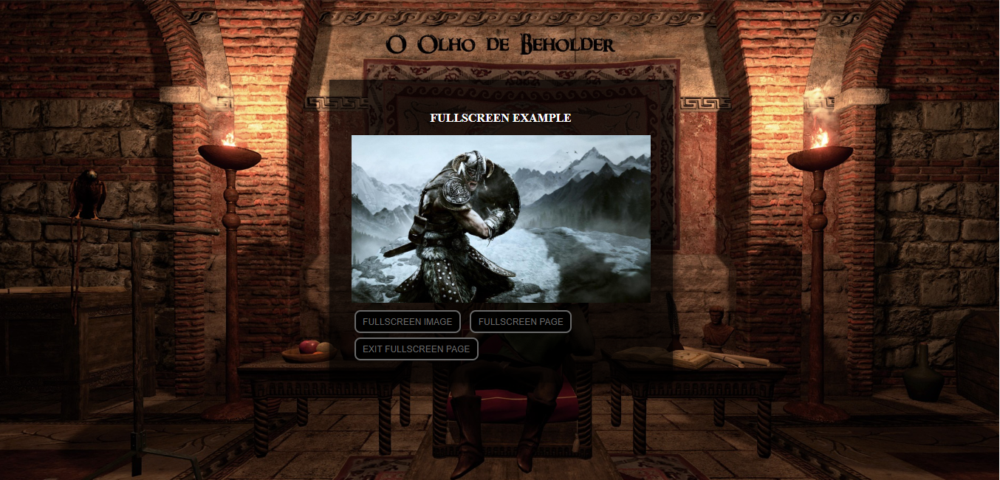

1. Fullscreen API
   - A API de tela cheia fornece uma maneira fácil para o conteúdo da web para ser apresentado usando a tela inteira do usuário
   
1. Links do Exemplo
   - **Link Seminário**: https://github.com/liberioafonso/seminario-html5
   - **Link do exemplo**: https://github.com/liberioafonso/cefet-web-weblot/tree/2019/01/apis/fullscreen/
1. Créditos
   - **Autores**: Libério Afonso e Guilherme Medeiros   
   - **Material Utilizado**: https://developer.mozilla.org/pt-BR/docs/Web/API/Fullscreen_API
