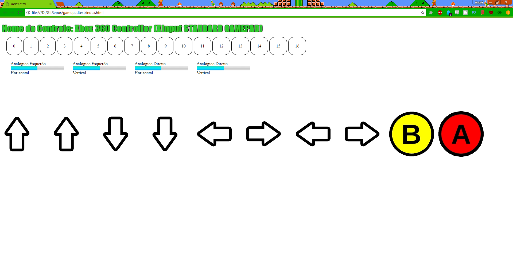

# _GAMEPAD API_
Uma API para facilitar a utilização de diferentes controles em websites.

## Links do Exemplo
- Link para seminário: [slides no Google Drive][slides]
- Link para exemplo: [pagina no github]

## Créditos
Este trabalho foi realizado em 2018/01 para a disciplina de Programação para Web do CEFET-MG no Campus II de Belo Horizonte.

Autores:

1.André Luís Borges de Oliveira
1.André Perazio Givisiez Fonseca
1.Thiago Magno Gomes

Atribuições:

- Imagem do Konami Code por [cursedhydra][konami];
- Fontes de pesquisa: [Mozilla Developer Network][pesquisa2] e [Beej's Bit Bucket][pesquisa];
- [Mestre Jedy][jedai]

[konami]:https://suwalls.com/digital-art/konami-code-43623/
[slides]:https://docs.google.com/presentation/d/17P1ZGyCth7J0BxAp7Seh1k2lX4IQWgy0NtS6r-FFMCc/edit?usp=sharing
[vivo]: https://fegemo.github.io/cefet-web-weblot/apis/gamepad-api/
[pesquisa]:http://beej.us/blog/data/javascript-gamepad/
[pesquisa2]:https://developer.mozilla.org/pt-BR/
[jedai]: https://github.com/fegemo
