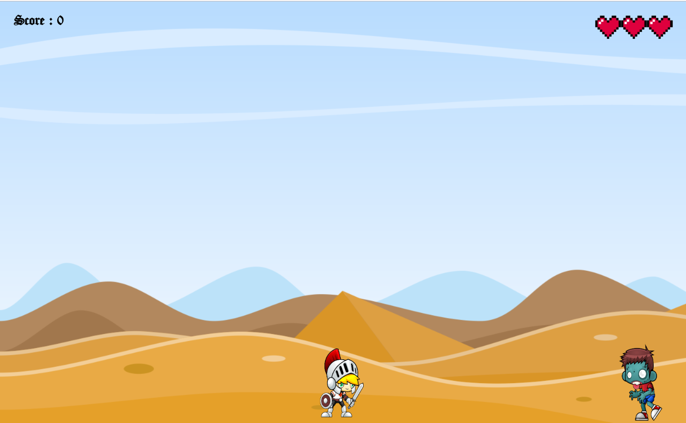

# _Gamepad API, Vibration API e Ambient Light API _

Exemplo de uso da API de _Gamepad_ (utilizar joystick para jogar em dispositivos moveis) do HTML5.
Exemplo de uso da API de _Vibration_ (Vibração do dispositivo móvel) do HTML5.
Exemplo de uso da API de _Battery Status API_ (manipulação de eventos de acordo com o status da bateria do dispositivo móvel) do HTML5.

## Links do Exemplo

- Link para seminário: [slides de aula][slides]
- Link para exemplo publicado: [página no GitHub][vivo]

## Créditos 

Este trabalho foi realizado em 2019/01 para a disciplina de Programação para Web do CEFET-MG no Campus II de Belo Horizonte.

Autor(es):

1. Jonathan Candido da silva Rodrigues (201612040268)
2. João Soares de Matos Neto ()
3. Raylander Frois Lopes (201612040101)

Atribuições:

- Sprites utilizadas extraidas do site [gameart2d][sprites]

[slides]: https://prezi.com/view/tbxj2oWPCbFtlnIuXPBN/
[sprites]: https://www.gameart2d.com/freebies.html
[vivo]: https://fegemo.github.io/cefet-web-weblot/apis/gamepad-battery-vibration/
