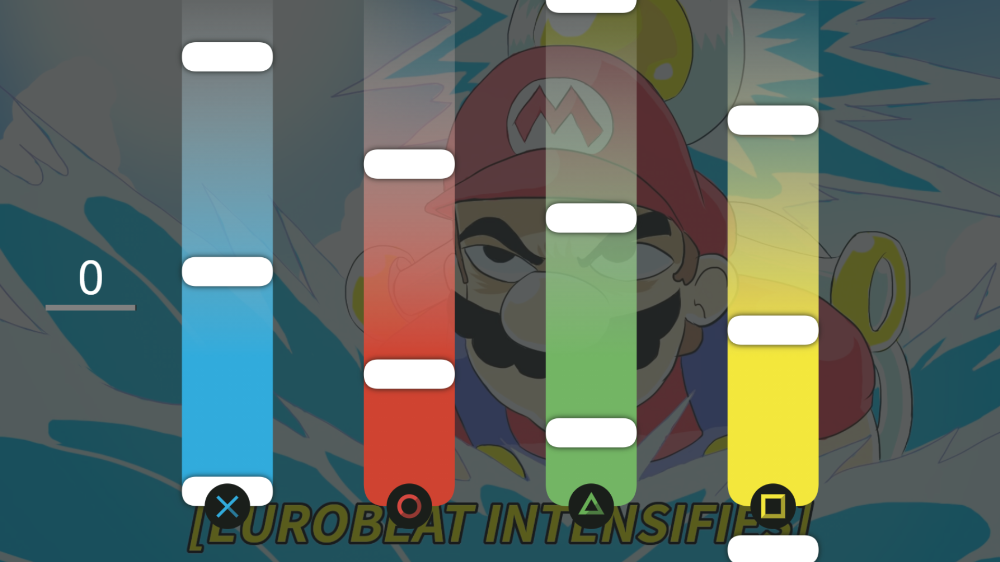

# _Gamepad API e Vibration API_

Exemplo de uso das APIs de _gamepad_ e _vibration_ do HTML5. Veja o arquivo [`script/game.js`][js] para detalhes.

- Link para exemplo publicado: [página no GitHub][vivo]

## Créditos

Este trabalho foi realizado em 2021/01 para a disciplina de Programação para Web do CEFET-MG no Campus II de Belo Horizonte.

Autor(es):

1. Antonio Augusto Diniz Sousa (201712040146)
2. Guilherme Gomes Giacomin (201712040251)
3. Matheus de Souza Coelho (201712040421)
4. Rodrigo Dias Moreira (201712040456)
5. Uriel Barcelos Braga (201712040278)

Atribuições:

- Imagens dos botões, criado por [Rodrigo D. Moreira][rodrigodm-author]
- Músicas Delfino Plaza [Eurobeat remix] / Wii Shop Channel [Eurobeat remix] e imagem de fundo, criados por [Dominic Ninmark][dominicnmk-author]
- Música Among Us [Trap remix] e imagem de fundo, criados por [Leonz][leonz-author]
- Música Super Mario Bros Theme e imagem de fundo, criados por [Nintendo][nintendo-author]

[js]: scripts/game.js
[vivo]: https://fegemo.github.io/cefet-web-weblot/apis/gamepad-vibration/
[rodrigodm-author]: https://github.com/rodrigodmoreira
[dominicnmk-author]: https://www.youtube.com/user/NitroFlasher
[leonz-author]: https://www.youtube.com/channel/UCjGfaP-eiT-XGeCRjGM9fGQ
[nintendo-author]: https://www.nintendo.pt/
