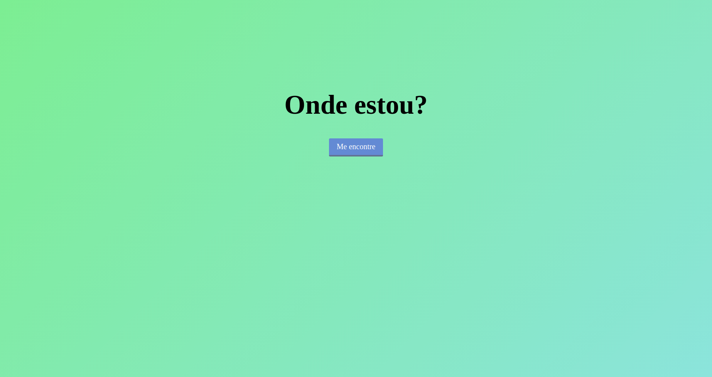

# _Geolocation API_

Exemplo de uso da API de _geolocation_ (localização) do HTML5.

## Links do Exemplo

- Link para seminário: [slides]
- Link para exemplo publicado: [vivo]
## Créditos

Este trabalho foi realizado em 2018/02 para a disciplina de Programação para Web do CEFET-MG no Campus II de Belo Horizonte.

Autor(es):

1. Luiz Flávio Costa de Lima 
2. Natália Natsumy Padua Iassanori
3. Samuel Cury

Atribuições:

[slides]: https://github.com/nnatsumy/reveal.js/blob/master/index.html
[vivo]: https://fegemo.github.io/cefet-web-weblot/apis/geolocation/