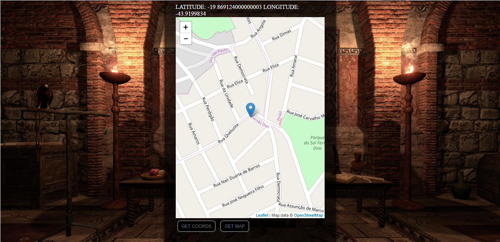

1. FullscreenAPI
   - A API geolocation permite que o usuário forneça sua localização a aplicativos web se ele desejar. Por questões de privacidade, o usuário é perguntado se permite fornecer informações de localização.
   
1. Links do Exemplo
   - **Link Seminário**: https://github.com/liberioafonso/seminario-html5
   - **Link do exemplo**: https://github.com/liberioafonso/cefet-web-weblot/tree/2019/01/apis/geolocation/
1. Créditos
   - **Autores**: Libério Afonso e Guilherme Medeiros   
   - **Material Utilizado**: https://developer.mozilla.org/pt-BR/docs/Using_geolocation
