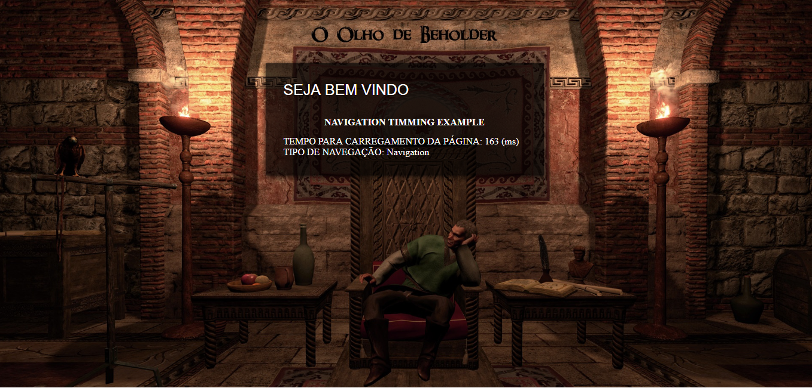

1. Navigation Timming API
   - A API Navigation Timing fornece dados que podem ser usados para medir a performance de um website.
   
1. Links do Exemplo
   - **Link Seminário**: https://github.com/liberioafonso/seminario-html5
   - **Link do exemplo**: https://github.com/liberioafonso/cefet-web-weblot/tree/2019/01/apis/navigation-timming/
1. Créditos
   - **Autores**: Libério Afonso e Guilherme Medeiros   
   - **Material Utilizado**: https://developer.mozilla.org/pt-BR/docs/Web/API/Navigation_timing_API
