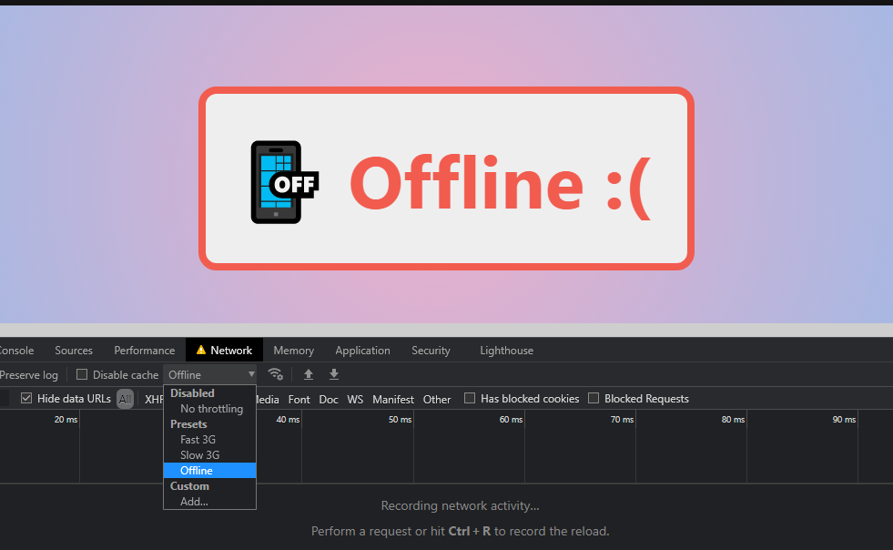

# Online/Offline Status API

Exemplo de uso da API de Online/Offline Status do HTML5. Veja o arquivo [script/status.js][js] para detalhes.

- Link para exemplo publicado: [página no GitHub][vivo]

## Créditos

Este trabalho foi realizado em 2021/01 para a disciplina de Programação para Web do CEFET-MG no Campus II de Belo Horizonte.

Autor(es):

1. Matheus Brant Marques (201612040136)

Atribuições:

[js]: scripts/status.js
[vivo]: https://fegemo.github.io/cefet-web-weblot/apis/online-offline/
