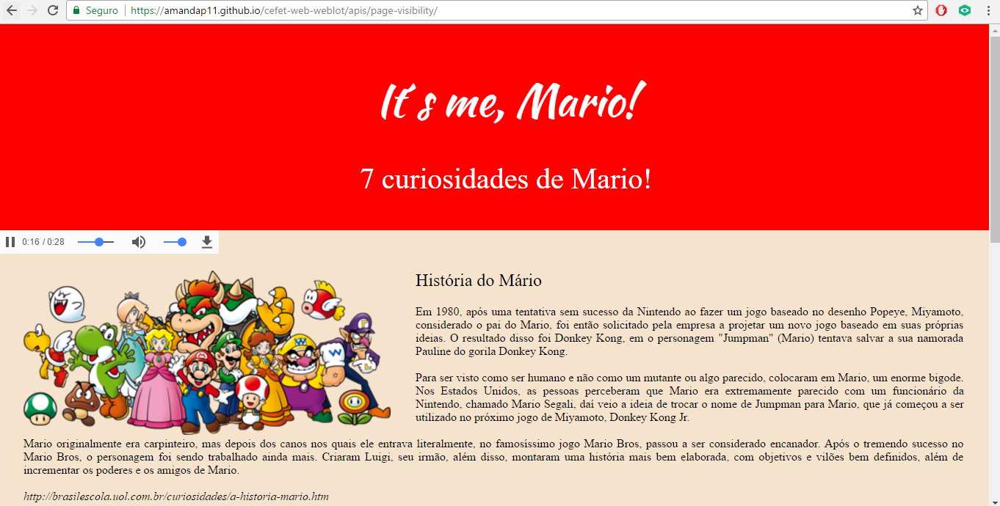

# Page Visibility API

1) Esta API permite que você saiba se uma página está visível ou em foco.

2) Apresentação: https://1drv.ms/p/s!ArMCktTr1HmNhctSJWtqpMwBjHLGyQ 

Exemplo: https://amandap11.github.io/cefet-web-weblot/apis/page-visibility/

3) Amanda Fernandes Pereira, Brunho Henrique Costa Coletinha, Vinícius Mendes Pinto
