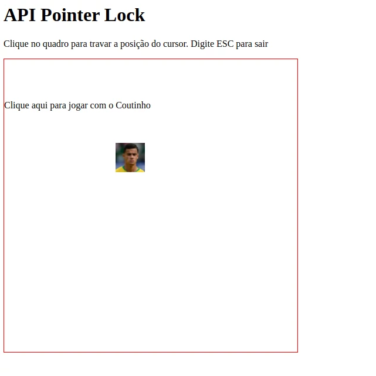

# _Pointer Lock API_

Exemplo de uso da API de _pointer lock_ (travar o cursor) do HTML5. Veja o arquivo [`scripts/pointer-lock.js`][js] para detalhes.

- Link para exemplo publicado: [página no GitHub][vivo]

## Créditos

Este trabalho foi realizado em 2021/01 para a disciplina de Programação para Web do CEFET-MG no Campus II de Belo Horizonte.

Autor(es):

1. Arthur Novaes (201622040341)
2. Bernard Menezes (201612040187)
3. Heloísa Toledo (201412040370)
4. Tiago Araújo (20161240403)

[js]: scripts/pointer-lock.js
[vivo]: https://fegemo.github.io/cefet-web-weblot/apis/pointer-lock/