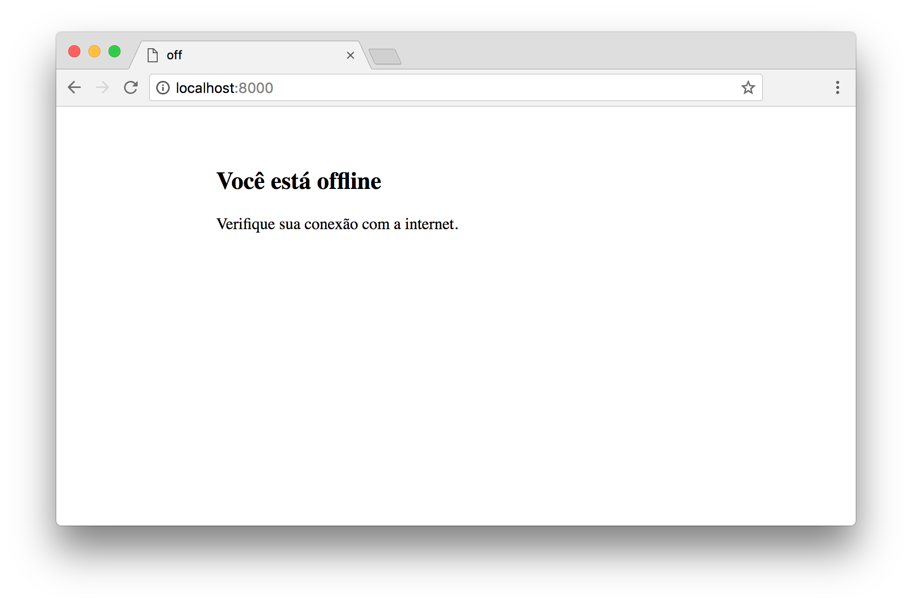

# _Service Worker API_

Exemplo de uso da API de _Service Worker_.

## Links do Exemplo

- Link para seminário: [slides de aula][slides]
- Link para exemplo publicado: [página no GitHub][vivo]

## Créditos

Este trabalho foi realizado em 2018/01 para a disciplina de Programação para Web do CEFET-MG no Campus II de Belo Horizonte.

Autor(es):

1. Cosme Lopes
1. Felipe Freitas
1. Luis Nascimento

[slides]: https://...
[vivo]: https://...
