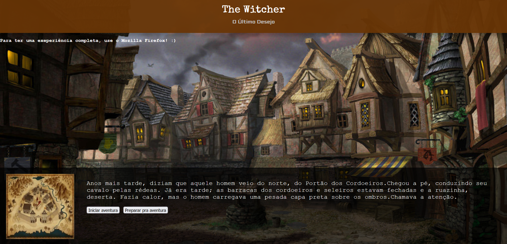

# _Service Workers e Push API_

Exemplo de uso de um Service Worker e da API de _push_ (enviar mensagens do servidor para o navegador mesmo que o site não esteja aberto) do HTML5. Veja o arquivo [`public/main.js`][js] para detalhes.

- Link para exemplo publicado: [página no GitHub][vivo]

## Créditos

Este trabalho foi realizado em 2021/01 para a disciplina de Programação para Web do CEFET-MG no Campus II de Belo Horizonte.

Autor(es):

1. Eduardo Alves de Freitas (201722040017)
2. Marcelo Ferreira Ricoy De Moro (201722040122)
3. Sinval de Deus Vieira Júnior (201722040505)

Atribuições:

- Imagem da cidade medieval de fundo, criada por [Folko Streese][background-author]

[js]: public/main.js
[vivo]: https://fegemo.github.io/cefet-web-weblot/apis/service-workers-e-push/
[background-author]: https://www.artstation.com/artwork/rdV5
