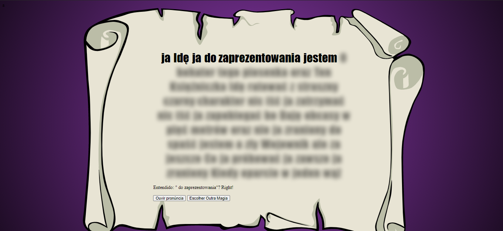

# _Speech Recognition_ e _Speech Synthesis_ 

Exemplo de uso das APIs de _Speech Recognition_ e _Speech Synthesis_ do HTML5. Veja os arquivo [`scripts/speech-recognition.js`][js1] e [`scripts/speech-synthesis.js`][js2] para detalhes.

- Link para exemplo publicado: [página no GitHub][vivo]

## Créditos

Este trabalho foi realizado em 2021/01 para a disciplina de Programação para Web do CEFET-MG no Campus II de Belo Horizonte.

Autor(es):

1. Lucas Dutra Marioza dos Santos (201522040331)
2. Matheus de Oliveira Marçal (201722040149)
3. Matheus Galantine Diniz Machado (201522040218)
4. Pedro Frois Bittencourt (201522040463)
4. Vitor Gomes Soares Lins Peixoto (201522040196)

[vivo]: https://fegemo.github.io/cefet-web-weblot/apis/speech-recognition-e-speech-synthesis/

[js1]: scripts/speech-recognition.js
[js2]: scripts/speech-synthesis.js
[vivo]: https://fegemo.github.io/cefet-web-weblot/apis/drag-and-drop/
