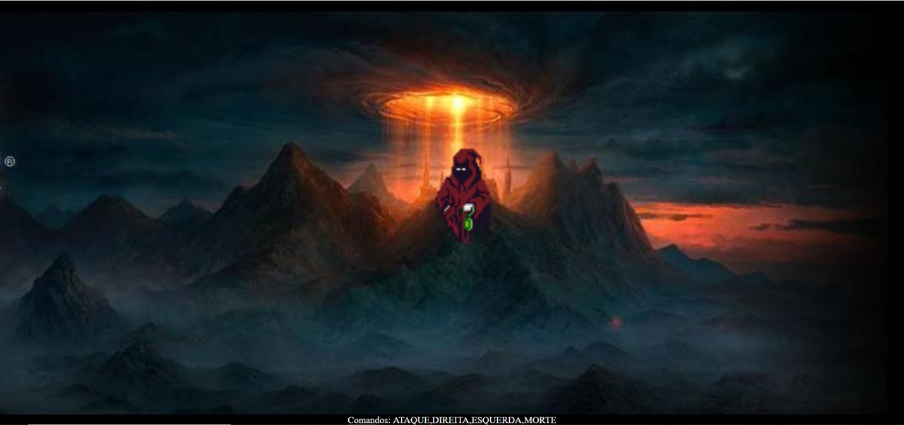

# Web Animations API e Speech Recognition API

Exemplo de uso da Web Animations API e do Speech Recognition API, ambas do HTML5.

## Links do Exemplo

- Link para seminário: [Apresentação][slides]
- Link para exemplo publicado: [página no GitHub][vivo]

## Créditos

Este trabalho foi realizado em 2019/01 para a disciplina de Programação para Web do CEFET-MG no Campus II de Belo Horizonte.

Autor(es):

1. Ana Paula Victoy de Almeida Marques
2. Juliane Guedes Pascoal

Atribuições:

- Imagem de fundo do site First Age Reality RPG [fundo]
- Fantasma criado por Warren Clark [fantasma]
- Programa utilizado para separar sprints criado por Maurício [programa]

[slides]: https://docs.google.com/presentation/d/139Y_mzb2V949TOtIx95KAeXTat8NwFELhBKcrKxQd4o/edit?usp=sharing
[vivo]: https://fegemo.github.io/cefet-web-weblot/apis/speech-recognition-web-animations/
[fundo]:http://conquerors-of-arda.forumeiros.com/
[fantasma]: https://lionheart963.itch.io/
[programa]: https://mbg3dmind.wordpress.com/2012/07/11/fatiador-de-sprite-sheet-e-editor-de-alinhamento/
