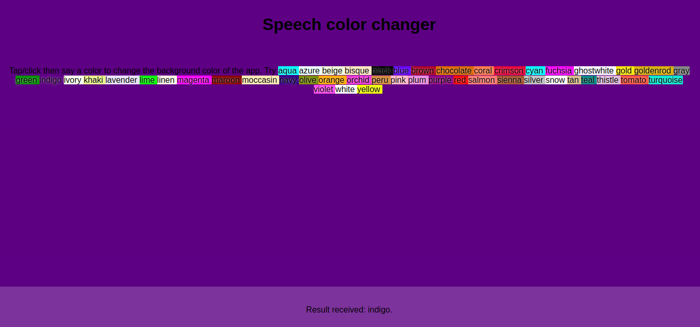

# _Speech Recognition API_

Exemplo de uso da API de _Speech Recognition_ (reconhecimento de fala).

## Links do Exemplo

- Link para seminário: [slides de aula][slides]
- Link para exemplo publicado: [página no GitHub][vivo]

## Créditos

Este trabalho foi realizado em 2018/02 para a disciplina de Programação para Web do CEFET-MG no Campus II de Belo Horizonte.

Autor(es):

1. Ana Luiza Sanches (201512040169)
1. Gabriela Ramalho (201412040256)
1. Matheus Martins (201222040107)

Atribuições:

[slides]: https://gabiapple.github.io/cefet-web-seminario/
[vivo]: https://fegemo.github.io/cefet-web-weblot/apis/file/

