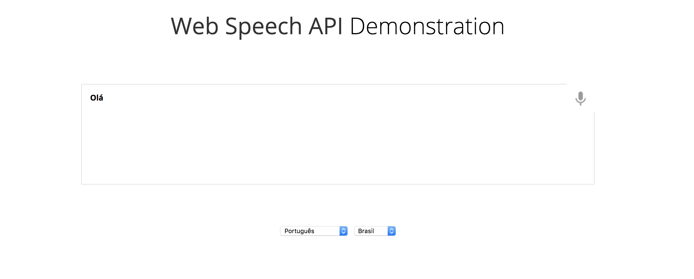

# _Speech Recognition API_

Exemplo de uso da API de _speech recognition_ (reconhecimento de fala) do HTML5.

## Links do Exemplo

- Link para seminário: [slides de aula][slides]
- Link para exemplo publicado: [página no GitHub][vivo]

## Créditos

Este trabalho foi realizado em 2018/01 para a disciplina de Programação para Web do CEFET-MG no Campus II de Belo Horizonte.

Autor(es):

1. Laura de Bella (201322040354 &larr; ~~matrícula da graduação!!~~)
2. Luis Carlos Cardoso ()

Atribuições:

- Fonte Overlock, criada por [Dario Manuel Muhafara][overlock-author]
- Fonte Chewy, criada por [_Sideshow Foundry_][chewy-author]
- Imagens dos monstrinhos, da empresa [Toshl][monsters-author]®

[slides]: https://fegemo.github.io/cefet-web/classes/js5/#32
[vivo]: https://fegemo.github.io/cefet-web-weblot/apis/drag-and-drop/
[overlock-author]: https://plus.google.com/105287894980881814285/about
[chewy-author]: https://profiles.google.com/sideshowfonts/about
[monsters-author]: http://toshl.com

https://developers.google.com/web/updates/2013/01/Voice-Driven-Web-Apps-Introduction-to-the-Web-Speech-API?hl=en