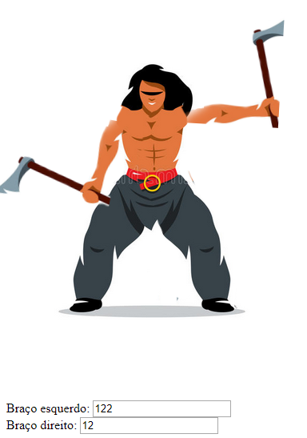

# _Web Animations API_

Exemplo de uso da API de _Web Animations_ do HTML5.

## Links do Exemplo

- Link para seminário: [slides do seminario][slides]
- Link para exemplo publicado: [página no GitHub][vivo]

## Créditos

Este trabalho foi realizado em 2018/01 para a disciplina de Programação para Web do CEFET-MG no Campus II de Belo Horizonte.

Autor(es):

1. Lauro César Jacques Santos(201412040213)
2. Daniel Silva da Fonseca (201412040396)

Atribuições:

- Imagem do Bárbaro por Romchello @ [autor-imagem][Dreamstime.com]

[slides]: https://docs.google.com/presentation/d/1HTLPbH51Qvx8z51aVkfB4zosPdHgzBWdxIdeJdmlJbY/edit?usp=sharing
[vivo]: https://fegemo.github.io/cefet-web-weblot/apis/web-animations/
[autor-imagem]: https://www.dreamstime.com/stock-illustration-vector-viking-warrior-two-axes-cartoon-illustration-barbarian-swinging-arms-isolated-white-background-image73441244
