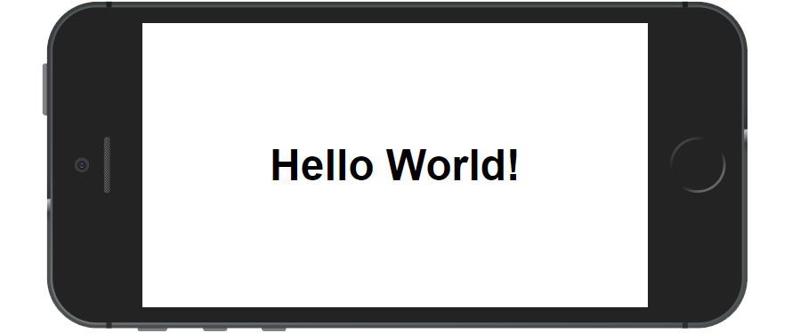

# _Web App Manifest_

Exemplo de uso da API de _Web App Manifest_ do HTML5.

## Descrição
O manifesto do aplicativo web fornece informações sobre uma aplicação (como nome, autor, icone, e descrição) em um arquivo de texto. O propósito do manifesto é instalar aplicações web na tela inicial de um aparelho, propiciando aos usuários um acesso mais rápido.

- Link para exemplo publicado: [página no GitHub][vivo]

## Importante
Essa API é feita para ser utilizada em conjunto com o PWA (_Progressive Web App_). O _Web App Manifest_ irá fornecer as informações para que seja possível instalar a aplicação web na tela inicial do celular. 
Para validar a API pelo desktop, basta olhar em:
`Inspecionar > Application > Manifest`
Nessa aba do inspecionar estarão as informações que serão utilizadas quando a a aplicação WEB for instalada no celular.

## Créditos

Este trabalho foi realizado em 2021/01 para a disciplina de Programação para Web do CEFET-MG no Campus II de Belo Horizonte.

Autor(es):

1. Arthur Novaes (201622040341)
2. Bernard Menezes (201612040187)
3. Heloísa Toledo (201412040370)
4. Tiago Araújo (20161240403)

Atribuições:

- Documentação do MSN [Web App Manifest MDN][mdn-link]
- PWA Tutorial for Beginners #3 - The Web App Manifest [You Tube Link][youtube-link]
- Can I Use [Can I Use link][can-i-use-link]

[vivo]: https://github.com/countinhos/cefet-web-weblot
[mdn-link]: https://developer.mozilla.org/pt-BR/docs/Web/Manifest
[youtube-link]: https://www.youtube.com/watch?v=AlEdGOLhuM8
[can-i-use-link]: https://caniuse.com/?search=web%20app%20manifest
