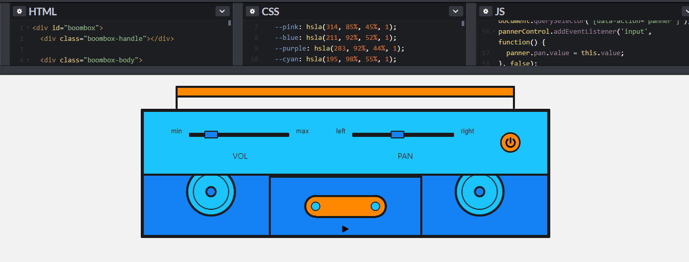

# _Web Audio API_

Exemplo de uso da API de _web audio_ (biblioteca sistema de controle de áudio) do HTML5.

## Links do Exemplo

- Link para seminário: [slides apresentação][slides]
- Link para exemplo publicado: [página no GitHub][vivo]

## Créditos

Este trabalho foi realizado em 2018/02 para a disciplina de Programação para Web do CEFET-MG no Campus II de Belo Horizonte.

Autor:

1. Daniel de Aguiar Gonçalves (201222040158)

Atribuições:

- Fonte [MDN ingles][mdn1-author]
- Fonte [MDN português][mdn2-author]

[slides]: https://slides.com/danielgoncalves-3/web-audio-api/#/
[vivo]: https://github.com/dangon1/cefet-web-weblot/tree/2018/02/apis/web-gl
[mdn1-author]: https://developer.mozilla.org/pt-BR/docs/Web/API/API_Web_Audio
[mdn2-author]: http://webglsamples.org/

