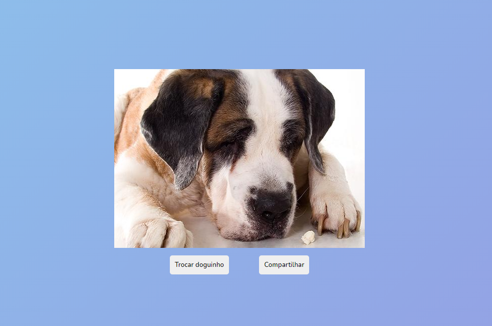

# _Drag and Drop API_

Exemplo de uso da API de _web share_ do HTML5. Veja o arquivo [`script/doguinhos.js`][js] para detalhes.

- Link para exemplo publicado: [página no GitHub][vivo]

## Créditos

Este trabalho foi realizado em 2021/01 para a disciplina de Programação para Web do CEFET-MG no Campus II de Belo Horizonte.

Autor(es):

1. Mateus Mourão de Freitas (201612040390)

Atribuições:

- Fonte Overlock, criada por [Dario Manuel Muhafara][overlock-author]
- Fonte Chewy, criada por [_Sideshow Foundry_][chewy-author]
- API dos doguinhos [Toshl][dogs-api]®

[js]: scripts/doguinhos.js
[vivo]: https://fegemo.github.io/cefet-web-weblot/apis/web-share/
[overlock-author]: https://plus.google.com/105287894980881814285/about
[chewy-author]: https://profiles.google.com/sideshowfonts/about
[monsters-author]: https://dog.ceo/dog-api/
