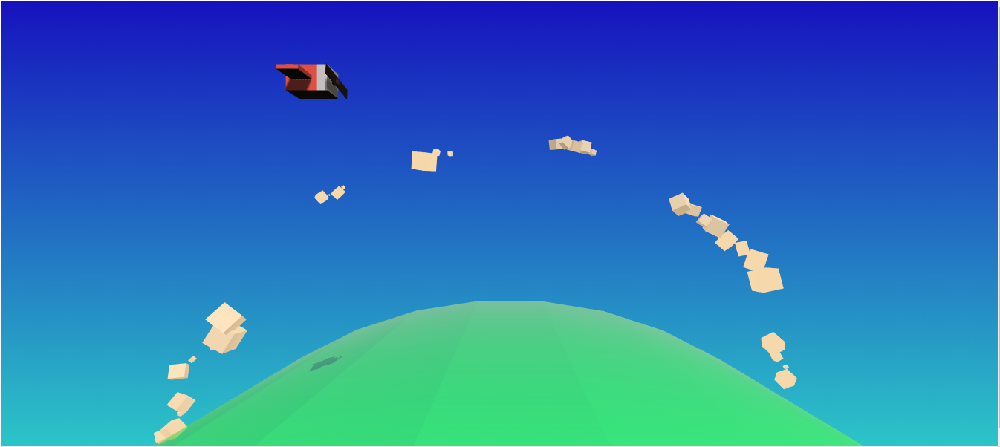

# _WebGL API_

Exemplo de uso da API de _webgl_ do HTML5.

## Links

- Link para seminário: [slides de aula][slides]
- Link para apresentação: [página no GitHub][slide]

## Créditos

Este trabalho foi realizado em 2019/01 para a disciplina de Programação para Web do CEFET-MG no Campus II de Belo Horizonte.

Autor(es):

1. Guilherme Henrique Campos Botelho (201322040125)
2. Marcos Tiago Ferreira Henriques (201412040108)
3. Gabriel Vasconcelos Martins (201312040289)

Atribuições:

- Javascript 3D library [three]

[slides]: https://fegemo.github.io/cefet-web/classes/js5/#51
[slide]: https://marcostiagofh.github.io/seminario-apresentacao-impressjs/
[three]: https://threejs.org/
