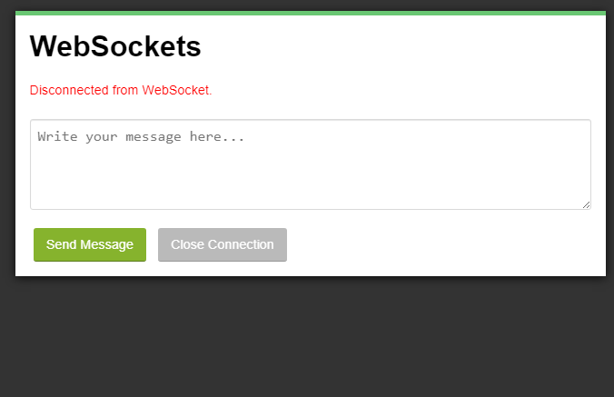

# _Web Sockets_

Exemplo de uso da API de _websockets_ do HTML5. Veja o arquivo [`src/src.js`][js] para detalhes.

- Link para exemplo publicado: [página no GitHub][vivo]

## Créditos

Este trabalho foi realizado em 2021/01 para a disciplina de Programação para Web do CEFET-MG no Campus II de Belo Horizonte.

Autor(es):

1. Gustavo Zille (201612040420)
2. Pierre Vieira (20183020762)
3. Vinícius França (201622040295)
4. Samuel Felipe (201622040325)
5. Marcos Xavier (201622040368)

[js]: src/src.js
[vivo]: https://fegemo.github.io/cefet-web-weblot/apis/websockets/
