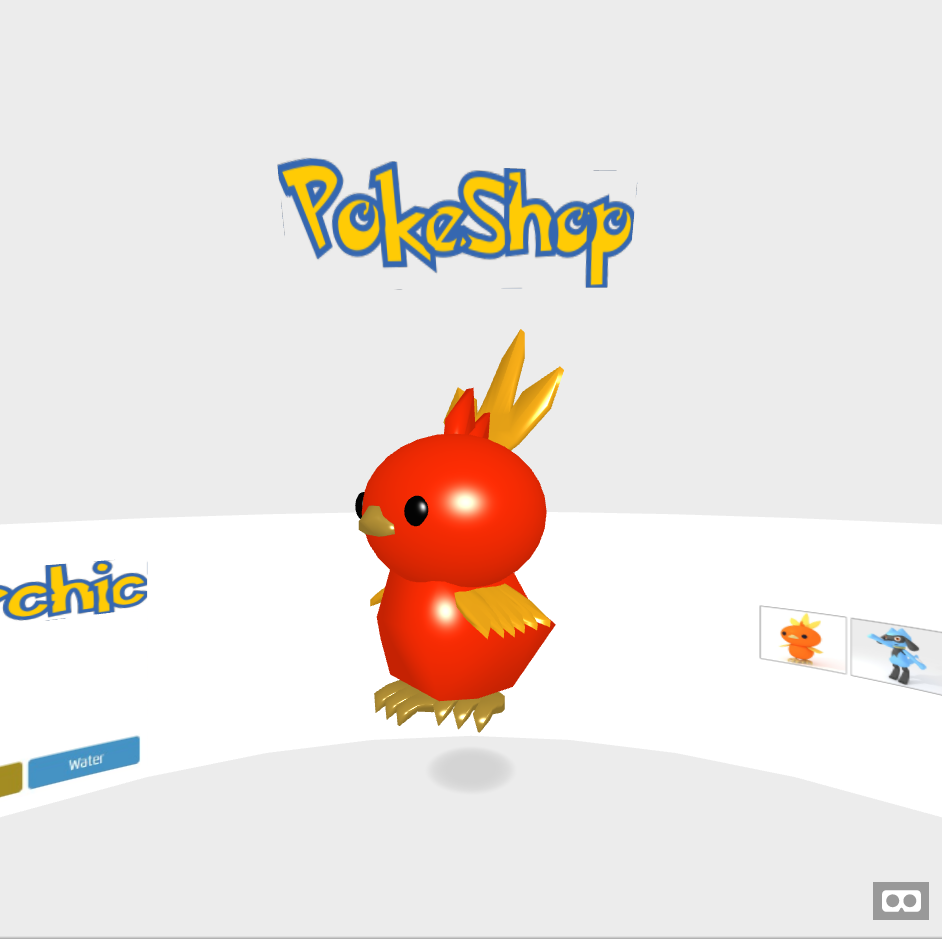

# _Drag and Drop API_

Exemplo de uso da _WebVR_ API (realidade virtual) do HTML5.

## Links do Exemplo

- Link para seminário: [slides ][slides]
- Link para exemplo publicado: [página no GitHub][vivo]

## Créditos

Este trabalho foi realizado em 2018/01 para a disciplina de Programação para Web do CEFET-MG no Campus II de Belo Horizonte.

Autor(es):

1. Nicolas Maduro (201422040259)
1. Renan Nascimento (201422040135)
1. Thales Nascimento (201422040224)

Atribuições:

- Modelos de pokemon: [Yhan Sugesta][a]
- Exemplo _vanilla_ de WebVR [webvr.info][b]
- [A-Frame][c]

[a]: https://www.blendswap.com/user/GreenBlender
[b]: https://webvr.info/samples/03-vr-presentation.html
[c]: https://aframe.io/
[slides]: WebVR_API.pptx
[vivo]: https://nicolasamaduro.github.io/cefet-web-pokestore/
